# KonturTestTask

## Как собрать и запустить приложение:

1. Клонировать репозиторий

```git clone https://github.com/sergeyfedorov02/KonturTestTask.git```

2. Перейти в рабочий каталог

```cd KonturTestTask```

3. Осуществить сборку проекта

```dotnet build --configuration=Release```

4. Перейти в каталог с исполняемым файлом

```cd KonturTestTask\bin\Release\net9.0\```

5. Запустить исполняемый файл с указанием параметров запуска

	- **Обязательные параметры:**
        - `-i`, `--input` - путь до входного файла в формате XML
            - Пример: `-i Input/Data3.xml`
    
    - **Необязательные параметры:**
        - `-o`, `--output` - путь до папки для результатов работы
            - Если не указан: создается папка `Output` в текущей директории
            - Файлы результатов: `Employees.xml` и `Employees.html`
	
    **Примеры запуска:**

    - Без указания выходной папки:
        ```
        KonturTestTask.exe -i Input/Data3.xml
        ```
    
    - С указанием выходной папки:
        ```
        KonturTestTask.exe -i Input/Data3.xml -o C:\Output
        ```

## Информация о проекте:

1. Требуется наличие .NET 9 SDK для того, чтобы построить и запустить приложение 

2. Юнит тесты реализованы в xUnit и находятся в проекте *KonturTests*

3. Тестовые XML-файлы находятся в папке *Input*

## Демонстрация работы

**Пример успешного запуска БЕЗ указания папки для результатов (выходной)**:

Изначальный файл **Data1.xml**

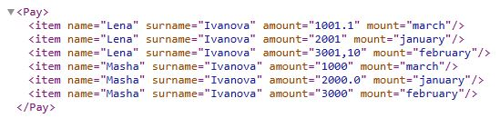

Запуск приложения

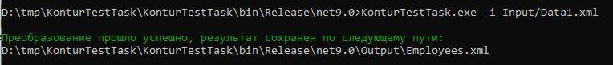

Содержание папки с результатами

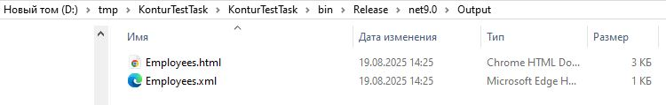

Выходной XMl файл *Employees.xml*

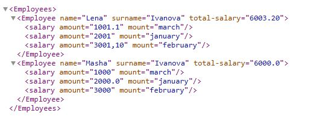

Выходной HTML файл *Employees.html*

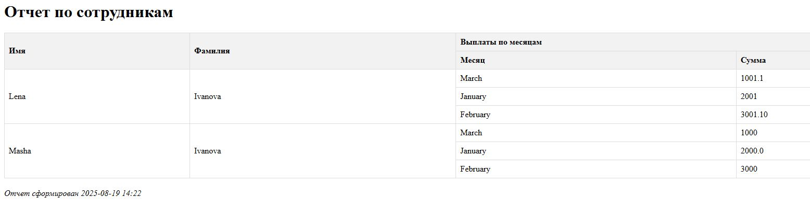

Измененный входной файл *Data1.xml*

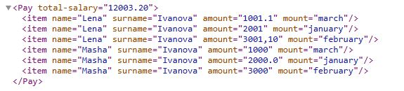

Изначальный файл **Data2.xml**

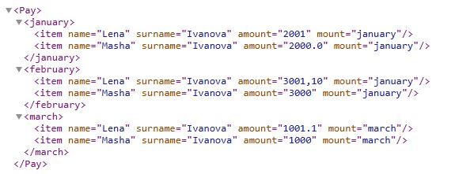

Запуск приложения


Содержание папки с результатами


Выходной XMl файл *Employees.xml*

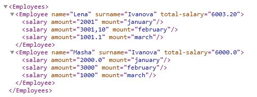

Выходной HTML файл *Employees.html*

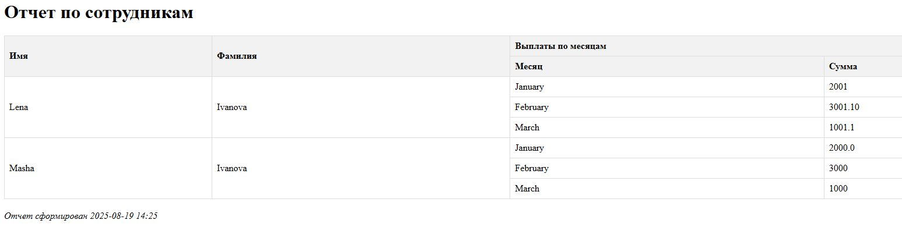

Измененный входной файл *Data2.xml*

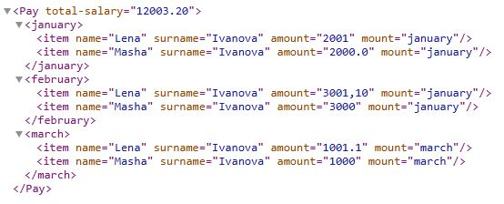


**Пример успешного запуска С указанием папки для результатов (выходной):**

Изначальный файл **Data3.xml**

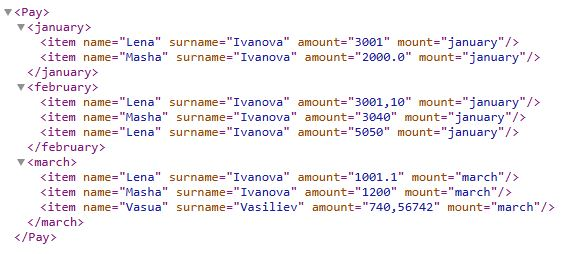

Запуск приложения

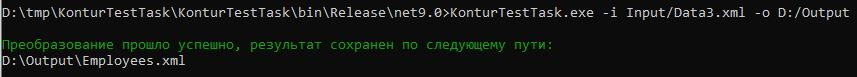

Содержание папки с результатами

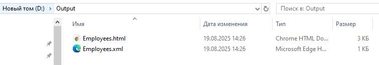

Выходной XMl файл *Employees.xml*

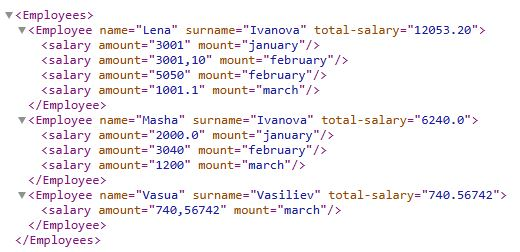

Выходной HTML файл *Employees.html*

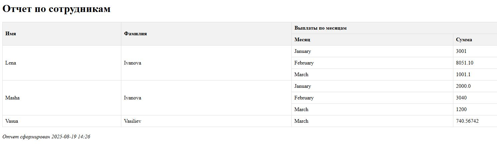

Измененный входной файл *Data3.xml*

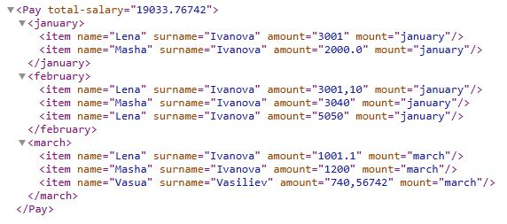

**Примеры НЕуспешного запуска:**

Запуск приложения без указания каких-либо параметров

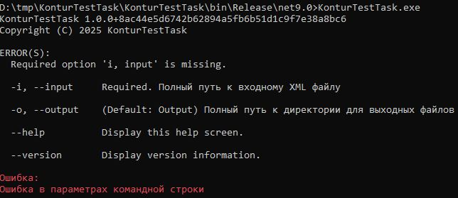

Указан неверный путь до входного файла

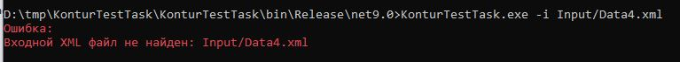

Если во входном файле будет неверная структура

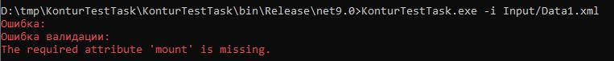

Невозможно создать выходную папку (например, такое имя уже объявлено для файла)

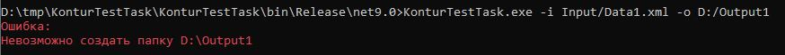
